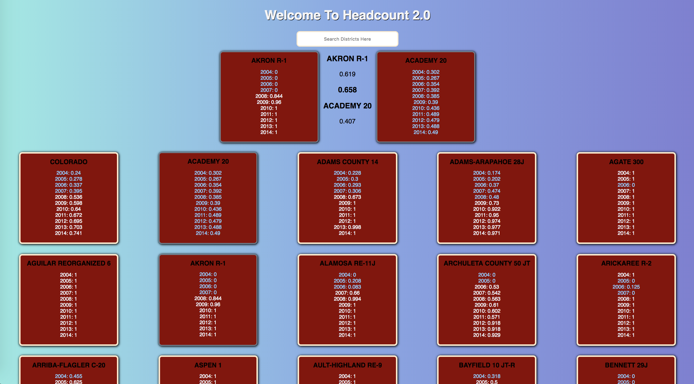

# HeadCount 2.0

HeadCount 2.0 is a project designed to challenge your skills at manipulating data and creating small, reusable React components.  

The application displays educational stats from districts within Colorado by year, per district and allows the user to search by district as well as compare stats between the two different districts.

This application was built using the `create-react-app` boilerplate.   



## Project Goals

* Separate application logic into small, testable functions.
* Create modular, reusable React components.
* Use propTypes to validate props passed to each component.
* Write meaningful, comprehensive unit and integration tests.

## To Get Started

run 
```
git clone https://github.com/michaelyons/headcount2.0.git 
```

run 
```
npm install
```

To start the app run
```
npm start
```
To run the testing suite
```
npm test
```

To run the linter
```
npm run eslint
```
